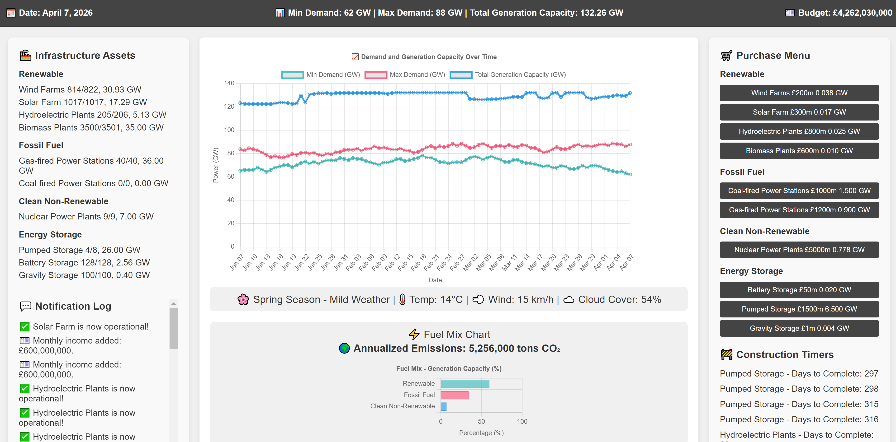
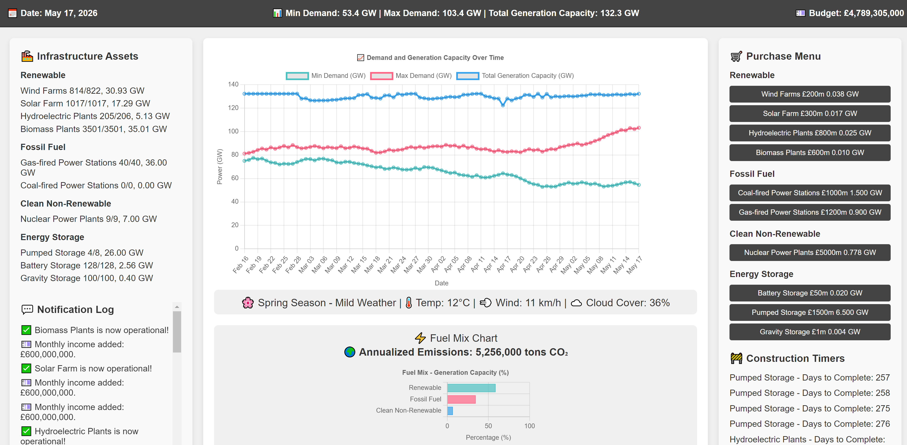
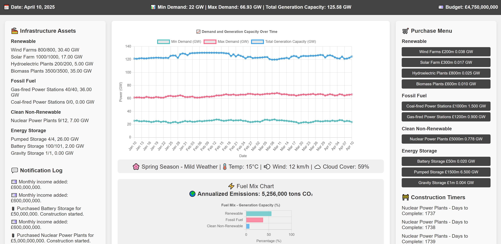

# Electric Infrastructure Simulator

## Overview

The **Electric Infrastructure Simulator** is an interactive web-based game that allows you to manage and expand an electric power grid. You can purchase various types of power generation assets, manage budgets, and respond to fluctuating demand and weather conditions. The goal is to balance power generation with demand while minimizing emissions and staying within budget.



## Features

- **Dynamic Simulation**: Experience day-to-day operations with changing weather, seasons, and demand patterns.
- **Asset Management**: Purchase and construct renewable, fossil fuel, and clean non-renewable power generation assets.
- **Weather Effects**: Weather conditions impact the efficiency of renewable energy sources like wind and solar.
- **Budget Management**: Keep track of operational costs, construction expenses, and monthly income.
- **Emissions Tracking**: Monitor annualized CO₂ emissions based on your energy mix.
- **Interactive Graphs**: Visualize demand vs. generation capacity over time and analyze the current fuel mix.

## Getting Started

### Prerequisites

- A modern web browser (Chrome, Firefox, Safari, Edge) with JavaScript enabled.

### Installation

#### Either

1. **Clone the Repository**

   ```bash
   git clone https://github.com/your-username/electric-infrastructure-simulator.git
   ```

2. **Navigate to the Project Directory**

   ```bash
   cd electric-infrastructure-simulator
   ```

3. **Open the Game**

   - Open the `game.html` file in your preferred web browser.

#### Or 

1. **Copy paste**

   - Copy paste the code from game.html in this repo into notepad or your preferred code editor, and save the file as UK_Electricity_Infrastructure_Sim.html

2. **Open the file**

   - Open the file in your preferred web browser.

## How to Play

- **Monitor the Dashboard**: Keep an eye on the date, weather conditions, demand indicators, budget, and emissions.
- **Purchase Assets**: Use the purchase menu to buy new infrastructure assets. Ensure you have sufficient budget.
- **Manage Construction**: Purchased assets require time to become operational. View construction timers in the sidebar.
- **Balance Supply and Demand**: As demand grows, make strategic decisions to expand your generation capacity.
- **Reduce Emissions**: Aim to minimize CO₂ emissions by investing in clean and renewable energy sources.

## Game Mechanics
- **Time Progression**

  - The game simulates one day every 0.5 seconds.
  - Seasons change, affecting weather patterns and renewable energy efficiency.

- **Weather and Efficiency**

  - **Wind Farms**: Efficiency varies with wind speed.
  - **Solar Farms**: Efficiency decreases with increased cloud cover.
  - **Other Renewables**: Hydroelectric and biomass plants have consistent output.

- **Demand Growth**

  - Electricity demand increases gradually over time.
  - Random fluctuations simulate real-world unpredictability.

- **Budget Updates**

  - Receive a monthly income of £600 million.
  - Pay operational costs for each operational asset daily.

- **Asset Categories**

  - **Renewable**: Wind, solar, hydroelectric, biomass.
  - **Fossil Fuel**: Coal and gas-fired power stations.
  - **Clean Non-Renewable**: Nuclear power plants.
  - **Energy Storage**: Battery, pumped, and gravity storage solutions.

## Technologies Used

- **HTML5 & CSS3**: Structure and styling of the game interface.
- **JavaScript**: Core game logic and interactivity.
- **Chart.js**: Rendering dynamic graphs and charts.
- **Luxon**: Date and time manipulation library.

## More Screenshots



## Contributing
Contributions are welcome! Please follow these steps:
1. Fork the repository.
2. Create a new branch (`git checkout -b feature/YourFeature`).
3. Commit your changes (`git commit -m 'Add YourFeature'`).
4. Push to the branch (`git push origin feature/YourFeature`).
5. Open a Pull Request.

## License
This project is licensed under the MIT License - see the [LICENSE](LICENSE) file for details.

## Acknowledgments
- **Inspiration**: Real-world energy management and infrastructure planning scenarios.
- **Cursor AI**: Making this was so much easier thanks to the Cursor code editor <3
- **GPT o1**: GPT o1 helped to refine the design and implementation of most of the features. 
